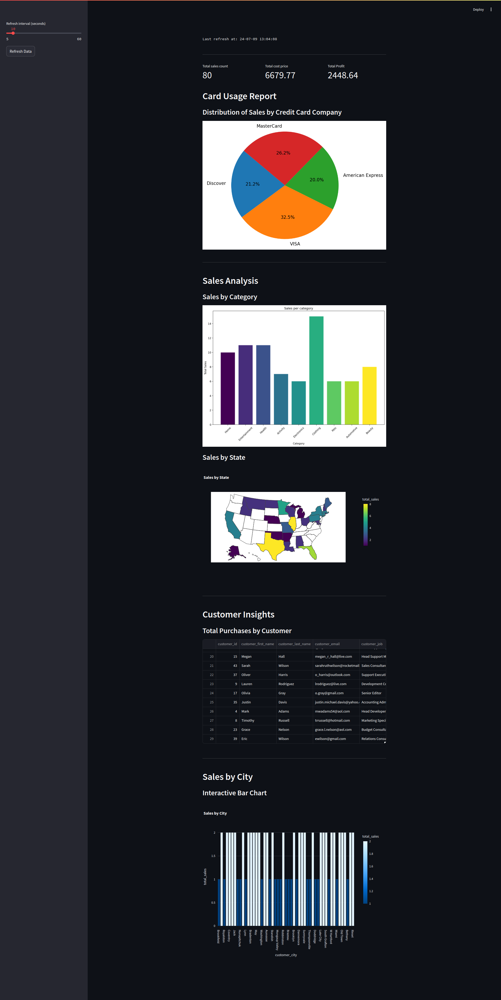

# Project Title

Kafka and PostgreSQL Integration for Sales Data Processing with Real-Time Dashboard

## Overview

This project demonstrates how to integrate Kafka with PostgreSQL to process sales data. The data is consumed from a Kafka topic, processed, and then stored in a PostgreSQL database. Additionally, a real-time dashboard is created using Streamlit to visualize the sales data. This project includes scripts to create the necessary database tables, produce messages to Kafka, and consume messages from Kafka to insert into the database, as well as a Streamlit app for the real-time dashboard.

## Data Source

Data is sourced from [Cobbl.io](https://cobbl.io/). The data fields include:

- `first_name`
- `last_name`
- `email`
- `credit_card_company`
- `credit_card_number`
- `credit_card_expiration_date`
- `category`
- `sale_id`
- `product_name`
- `sale_price`
- `cost_price`
- `job_title`
- `zipcode`
- `state`
- `city`
- `street`

## main.py Summary

The `main.py` script is responsible for reading sales data from a JSON file, producing messages to a Kafka topic, and ensuring that the necessary tables are created in a PostgreSQL database. This script handles the integration between Kafka and PostgreSQL for processing and storing sales data.

### Functionality

- **Table Creation**: The script ensures that the required tables (`categories`, `products`, `customers`, and `sales`) are created in the PostgreSQL database if they do not already exist.

- **Data Reading**: It reads data from a JSON file specified by the `SOURCE_PATH`.

- **Message Production**: For each record in the JSON file, the script produces a message to a Kafka topic (`sales_topic`). It includes a random delay between 1 to 5 seconds between producing each message to simulate real-time data ingestion.

- **Kafka Delivery Report**: The script includes a callback function to handle delivery reports from Kafka, logging whether each message was successfully delivered or if there was an error.

## sales.py Summary

The `sales.py` script integrates Kafka and PostgreSQL for handling sales data processing. It subscribes to the `sales_topic` Kafka topic to consume incoming messages, each containing JSON-encoded sales data. The script ensures that this data is efficiently stored in corresponding PostgreSQL tables (`categories`, `products`, `customers`, and `sales`). Here's a detailed breakdown of its functionality:

### Functionality

- **Kafka Configuration**: Initializes a Kafka consumer (`consumer`) and producer (`producer`) with specified configurations (`conf`), including bootstrap servers and consumer group settings.

- **Database Interaction Functions**:
  - `fetch_or_create_category(conn, cur, category)`: Checks if a category exists in the database. If not, it creates a new category and returns its ID.
  - `fetch_or_create_product(conn, cur, params)`: Checks if a product exists based on its name. If not, it creates a new product entry and returns its ID.
  - `fetch_or_create_customer(conn, cur, params)`: Checks if a customer exists based on their first name, last name, and email. If not, it creates a new customer entry and returns its ID.
  - `create_sales(conn, cur, params)`: Inserts a new sales record into the database, linking a customer ID with a product ID.

- **Main Execution**:
  - Connects to the PostgreSQL database (`sales`).
  - Subscribes to the Kafka topic (`sales_topic`) to start consuming messages.
  - Polls for incoming messages from Kafka and processes each message:
    - Parses the JSON message to extract relevant sales data.
    - Uses the respective database interaction functions to ensure all necessary data (categories, products, customers) is managed and linked correctly.
    - Inserts sales data into the `sales` table, ensuring data integrity and relationships.

## dashboard_postgres.py Summary

The `sales_dashboard.py` script utilizes Streamlit and Apache Spark for real-time visualization and analysis of sales data stored in a PostgreSQL database. Here's an overview of its functionality:

### Functionality

- **Streamlit Setup**: Integrates Streamlit to create a dynamic dashboard for real-time data visualization and insights.

- **Apache Spark Configuration**: Configures SparkSession to connect with Kafka and PostgreSQL for data processing and querying.

- **Data Fetching and Processing**:
  - Reads sales data from PostgreSQL tables (`sales`, `categories`, `products`, `customers`) using Apache Spark.
  - Calculates key metrics such as total sales, total cost price, total profit, and generates various reports based on sales categories, states, cities, and customer insights.

- **Visualization**:
  - Displays metrics using Streamlit's built-in components like `st.metric` for key statistics.
  - Generates visualizations including donut charts, bar charts, choropleth maps, and interactive charts using Plotly and Matplotlib for clear and interactive data representation.

- **Dynamic Refresh**:
  - Includes a sidebar for setting the refresh interval of the dashboard data.
  - Utilizes `st_autorefresh` to automatically update the dashboard at defined intervals, enhancing real-time data monitoring.

## Execution

```bash
# Execute main.py to produce sales data to Kafka and store in PostgreSQL
python main.py

# Execute sales.py to consume data from Kafka and process sales into PostgreSQL tables
python sales.py

# Execute Streamlit dashboard to visualize real-time sales analytics from PostgreSQL
streamlit run dashboard_postgres.py
```

## Dashboard


## OPTIONALLY
Analytics report generation with utilization of kafka only

# reports_kafka.py summary
The provided Python script leverages Apache Spark and PySpark to ingest streaming sales data from a Kafka topic, perform real-time analytics, and send aggregated results to different Kafka topics. It initializes a Spark session with necessary configurations, defines a schema for the sales data, reads JSON-formatted messages from Kafka, computes various real-time metrics such as total sales, sales by category, state, and city, customer insights, and credit card usage statistics. Each computed metric is then processed in batches and written back to designated Kafka topics for continuous monitoring and analysis of sales performance and customer behavior.

# dashboard_kafka.py summary
(It just displays the result, no visualizations are implemented.)

This Streamlit-based Python script creates a real-time dashboard for monitoring sales analytics sourced from Kafka topics and PostgreSQL. Here’s a brief summary of its functionality:

The script utilizes Streamlit for building a web-based dashboard with dynamic refresh capabilities. It establishes connections to Kafka for consuming data from specified topics (`total_sales_summary`, `sales_by_category`, etc.) using a custom Kafka consumer function. Data from PostgreSQL is fetched to display basic statistics like total sales count, product count, and category count. The dashboard includes a sidebar for setting refresh intervals and a button to manually refresh data display. For each topic, it fetches data from Kafka, stores it in a session state, and displays it using pandas DataFrames within Streamlit’s UI, providing real-time updates and visual representation of sales metrics.